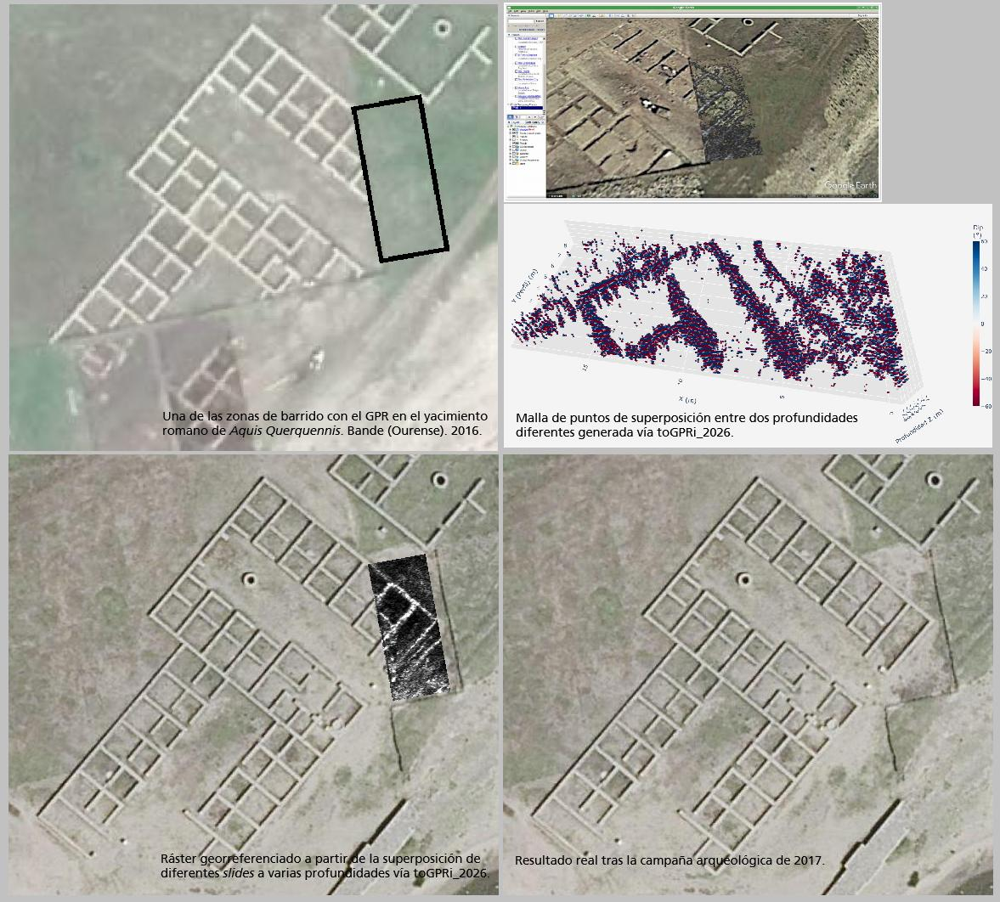
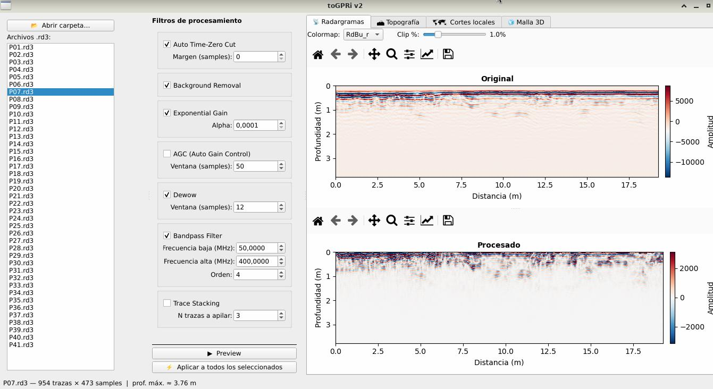

# toGPRi v2

**toGPRi v2** is a Python rewrite of the original toGPRi workflow for ground-penetrating radar (GPR) processing, visualization and georeferenced export, with a strong focus on local 3D cubes, depth slicing and GeoTIFF raster generation.

The project takes inspiration from the original GNU Octave version of toGPRi, which was designed to read RAMAC/MALÅ data, apply common radargram filters, build 3D matrices and export georeferenced raster products at different depth levels.

---

## Context and motivation

The figure below shows a representative result from the *Aquis Querquennis* Roman site (Bande, Ourense, 2016–2017), the field context that originally drove the development of toGPRi.
From left to right and top to bottom: the surveyed area with the prospected segment marked, the toGPRi v1 interface loaded in Google Earth, a 3D point mesh generated from stacked depth slices, the georeferenced raster overlaid on the aerial photograph, and — most importantly — the real excavation result in 2017.



---

## Interface

toGPRi v2 provides a Qt-based graphical interface with four main panels: **Radargrams**, **Topography**, **Local slices** and **3D mesh**.

The radargrams panel shows the original and processed profiles side by side. The filter control column on the left includes Auto Time-Zero Cut, Background Removal, Exponential Gain, AGC, Dewow, Bandpass Filter and Trace Stacking. All filters can be previewed interactively or applied to the full set of selected profiles.



---

## Status

This repository is an active rewrite. The current codebase covers profile reading, filter processing, local cube construction and TIFF / GeoTIFF export with rotated georeferencing.

---

## Main features

- Read RAMAC/MALÅ `.rd3` / `.rad` profile data.
- Apply common GPR processing steps: time-zero correction, background removal, exponential gain, AGC, dewow, bandpass filter and trace stacking.
- Build local 3D cubes from sets of parallel profiles with configurable spacing and flip options.
- Extract exact depth slices and depth bands (max, mean, min).
- Export TIFF and GeoTIFF rasters with full support for rotated georeferencing.
- Correct local-cube plan orientation before export (`rotate_plan` flag).

---

## Repository structure

```text
toGPRi-v2/
├── togpri/
│   ├── io/
│   │   └── ramac.py
│   ├── processing/
│   │   ├── filters.py
│   │   ├── local_cube.py
│   │   └── local_tiff_export.py
│   └── gui/
├── docs/
│   └── images/
│       ├── aquis_context.jpg
│       └── gui_screenshot.jpg
├── pyproject.toml
└── README.md
```

---

## Installation

This project uses `pyproject.toml` with `setuptools` as build backend. Runtime dependencies are declared in `[project.dependencies]` and installed automatically.

Create a virtual environment and install the package in editable mode:

```bash
git clone git@github.com:jspinto/toGPRi_2026.git
cd toGPRi_2026
python -m venv .venv
source .venv/bin/activate
python -m pip install --upgrade pip
pip install -e .
```

Requires **Python 3.11 or newer**. Dependencies: `numpy`, `scipy`, `matplotlib`, `PyQt6`, `rasterio`, `pyproj`, `pandas`.

---

## Run

After installation, launch the GUI with:

```bash
togpri
```

---

## Typical workflow

1. Open a folder of `.rd3` profiles.
2. Select and configure processing filters.
3. Preview the result and apply filters to all selected profiles.
4. Switch to the **Local slices** panel, set cube geometry and export depth slices as GeoTIFF.

Programmatic example:

```python
from togpri.processing.local_cube import LocalCubeBuilder
from togpri.processing.local_tiff_export import export_local_cube_depth_tiff

builder = LocalCubeBuilder(
    velocity_m_ns=0.1,
    profile_spacings=0.5,
)

# builder.add_profile(gpr1)
# builder.add_profile(gpr2)
# ...

cube = builder.build()

export_local_cube_depth_tiff(
    cube,
    "local_slice_0.80m.tif",
    depth_m=0.80,
    rotate_plan=True,
    epsg=25829,
    origin_xy=(584478.89, 4647350.57),
    rotation_deg=0.0,
)
```

---

## Data and large files

Large binary outputs such as dense PLY files should stay outside normal Git history or be managed with Git LFS, because GitHub rejects files larger than 100 MB. The recommended approach is to keep raw data and large outputs in a separate folder outside the repository and only track code, configuration and small reference examples.

---

## Roadmap

- Improve import support and synthetic test data generation.
- Consolidate processing pipelines and metadata handling.
- Expand GUI tools for slice export and 3D inspection.
- Add unit tests for geometry, resampling and raster orientation.
- Export segmented 3D products such as filtered PLY subsets.

---

## Acknowledgements

This rewrite is rooted in the original **toGPRi v1** by Javier Sanjurjo Pinto, developed as part of a Master in Cultural Heritage Protection, and in the broader open-source GPR ecosystem.

Part of the recent work on local cube geometry, plan orientation correction, rotated GeoTIFF export, `pyproject.toml` packaging review and repository documentation was developed in collaboration with **Perplexity Pro**, used as a coding and documentation assistant throughout the toGPRi v2 rewrite process.

---

## License

GNU GENERAL PUBLIC LICENSE. Version 3, 29 June 2007.
